# not_makey

This repository describes how to manufacture a shield for the ESP32, and the code to program pins as resistive touch sensors that each send strings to a laptop over Bluetooth. It is programmed to send letters that correspond with PJ machine keycodes used in e.g. this workshop https://github.com/hackersanddesigners/interfacial-workout-23

On the board you can see which pins are connected to which letter. Pins without a letter are free to use for something else (e.g. sensors, LEDs), additional code can be written inside the sketch. 

To send a letter to the laptop: 
- connect laptop to bluetooth device "NOT_MAKEY" (esp and shield should be connected to a power source)
- open a textpad on the laptop
- touch a probe connected to one of the letter pins, and a probe connected to 3V3 to send a letter via Bluetooth

## acknowledgments

* Joylab's Jay Silver & Erik Rosenbaum's *MakeyMakey board* [https://github.com/sparkfun/MaKeyMaKey](https://github.com/sparkfun/MaKeyMaKey)
* Manualbl's [repository on using ESP32 as Bluetooth Keyboard](https://gist.github.com/manuelbl/66f059effc8a7be148adb1f104666467)
* Jack Christensen's [moving average library](https://github.com/JChristensen/movingAvg)


# v2 via Aisler board house


## bill of materials v.2 

* an ESP32 WROOM devkit, e.g. [this one from Espressif](https://www.espressif.com/en/products/modules/esp32) €14,49 at [Reichelt](https://www.reichelt.nl/nl/nl/entwicklungsboard-esp32-wroom-32e-esp32devkitc32e-p341303.html?&trstct=pos_1&nbc=1)
* mini usb programming cable e.g. [this one at kiwi](https://www.kiwi-electronics.com/nl/microusb-kabel-usb-a-naar-micro-b-15cm-3240?search=usb-A%20naar%20micro-b) €1,25
* 4x single row break-away female header strips (you need 4x a single row strips of 15 positions) e.g. [this one](https://www.reichelt.nl/nl/nl/vrouwelijke-connector-2-54mm-1x20-scheidbaar-vertind-fis-bl1-20-z-p283794.html?&nbc=1) at Reichelt €1,22 each
* 14x 22Mohm resistors e.g. [this one](https://nl.farnell.com/yageo/hhv-25jt-52-22m/res-22m-5-250mw-axial-metal-film/dp/1779371?st=22m%20ohm%20resistor) at Farnell €0,07 each. These can be hard to find in DIY shops you might need to look at Farnell, Mouser, or get some from China :(
* 14x (or more) MM dupont jumper wires to access the pins
* alligator clips to connect connective stuff to the board. 

## schematic

The schematic is the same

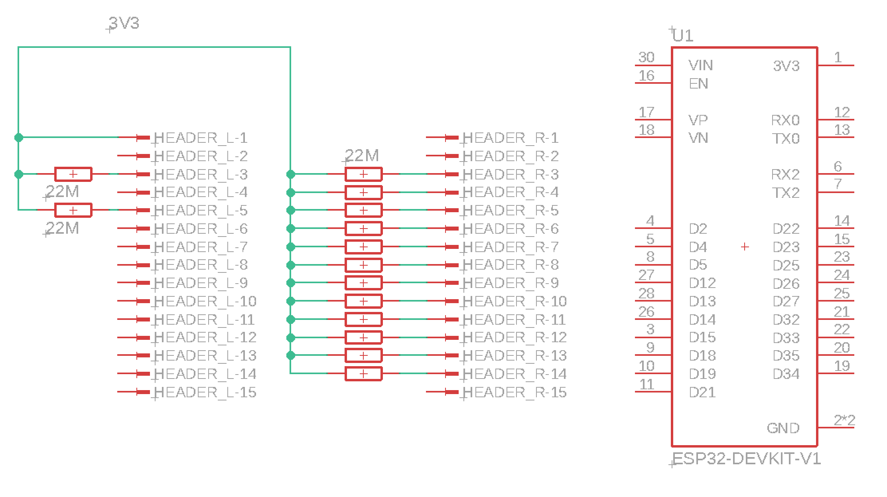 

## board design

The silkscreen is a bit more elaborate so you can see what character corresponds with which pin in the code.

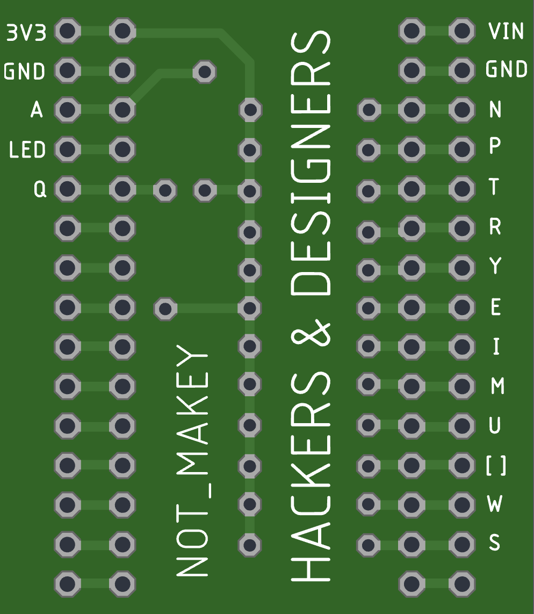 

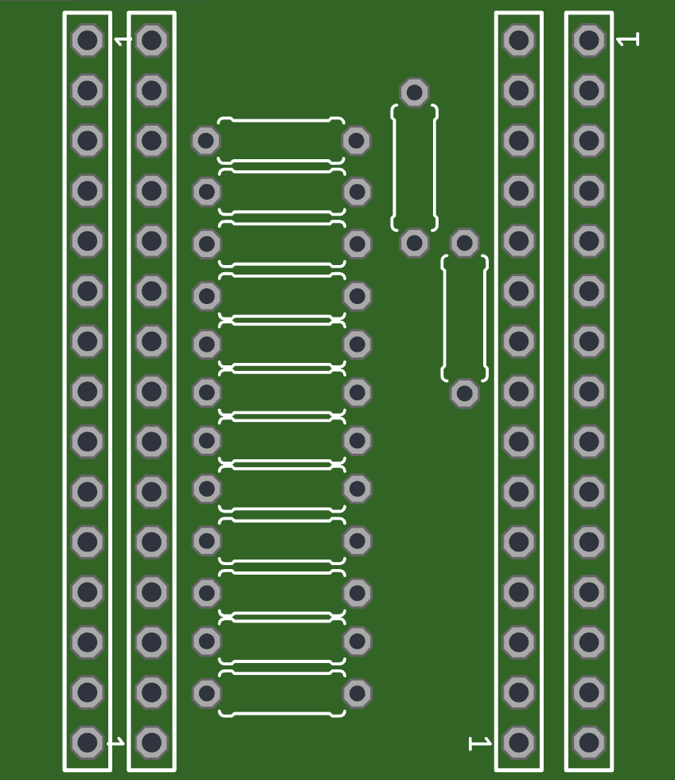 

## board house link

[https://aisler.net/p/JORJIJIP](https://aisler.net/p/JORJIJIP)

## soldering

For this board, you'll need to have the inner 2 connector rows facing down to connect to the ESP32 

The outer two connector rows are facing outward, to give access to the pins via jumper wires

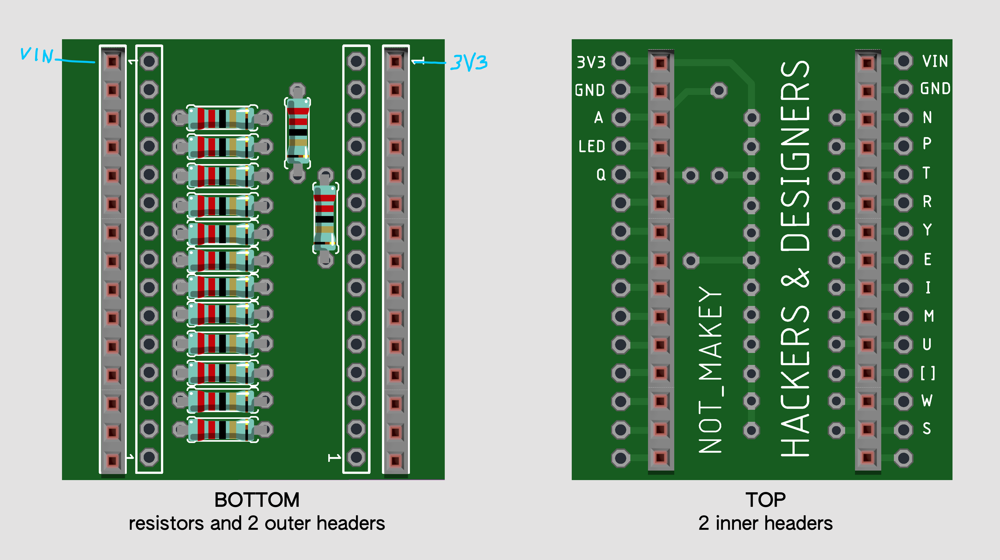


## programming the ESP

[Arduino code](./arduino/esp32_ble_makey_14probes/esp32_ble_makey_14probes.ino)

This program lets an ESP32 act as a keyboard connected via Bluetooth.
When a button attached to the ESP32 is pressed, it will generate the key strokes

In order to receive the message, add the ESP32 as a Bluetooth keyboard of your computer or mobile phone:

  1. Go to your computers/phones settings
  2. Ensure Bluetooth is turned on
  3. Scan for Bluetooth devices
  4. Connect to the device called "NOT_MAKEY" (you can change this name in the code)
  5. Open an empty document in a text editor
  6. Press the buttons attached to the ESP32 to generate different letters
 
If the probes don't respond too well you can troubleshoot and calibrate with simple code using the moving average filter and printing it to the serial. 

[Moving AVG testcode](./arduino/esp32_movingAVG_analogread/esp32_movingAVG_analogread.ino)
 
 
### Select the board

* Open Arduino preferences pane and paste the following URL in the box "Additional Boards Manager URLs"

```https://espressif.github.io/arduino-esp32/package_esp32_index.json```

* Open the Boards Manager. Go to Tools > Board > Boards Manager… 
* Search for "ESP32" and press install for "ESP32 by Espressif Systems"
* Go to > Tools > Board > ESP32 Arduino > ESP32 Devkit
* If it doesnt' show up, restart the Arduino IDE

### Compile the code to check libs are working

Compile to check if you have all the libraries. If not, check the console for troubleshooting. If necessary, install these: 

* MovingAVG library by Jack Christensen (via library manager)
* [BLE library](https://reference.arduino.cc/reference/en/libraries/esp32-ble-arduino/) (via library manger)
* [ESP32 libraries](https://github.com/espressif/arduino-esp32/tree/master/libraries) (I believe these are installed automaticallly with the ESP32 board files, so shouldn't give any problems).

### Testing 

* Connect the board to the computer with a USB data cable and upload the code
* Connect the ESP to the shield, taking care the orientation is correct. 
* Connect probes, e.g. jumper wires to one or two pins with a letter next to it
* Connect a laptop to the bluetooth device called "NOT_MAKEY" (name can be changed in line 63 in the code)
* Open a notepad on the connected laptop
* Test by touching a probe with one finger, while touching the 3V3 with the other finger. The principle is the same as makey makey, but here the resistors are connected as a pull-up resistor (keeps the signal high until a change is registered), so you touch one of the pins AND 3V3 (instead of one of the pins and GND as you would on the makey makey).


# Previous versions

## v1 via fablab

## tools

* Roland Modela MDX-20 with MODS for pcb production installed (only works in Chrome) modsproject.org

Note that this process doesn't require Gerber files, instead you need a 1000 DPI black and monochrome images of the bottom of the board, and separate files with holes and the board outline).

* Soldering station, solder, clippers

## bill of materials v.1 

* an ESP32 WROOM devkit, e.g. [this one from Espressif](https://www.espressif.com/en/products/modules/esp32) €14,49 at [Reichelt](https://www.reichelt.nl/nl/nl/entwicklungsboard-esp32-wroom-32e-esp32devkitc32e-p341303.html?&trstct=pos_1&nbc=1)
* mini usb programming cable e.g. [this one at kiwi](https://www.kiwi-electronics.com/nl/microusb-kabel-usb-a-naar-micro-b-15cm-3240?search=usb-A%20naar%20micro-b) €1,25
* 2x single row break-away female header strips (you need 2x a single row strips of 15 positions) e.g. [this one](https://www.reichelt.nl/nl/nl/vrouwelijke-connector-2-54mm-1x20-scheidbaar-vertind-fis-bl1-20-z-p283794.html?&nbc=1) at Reichelt €1,22 each
* 14x 22Mohm resistors e.g. [this one](https://nl.farnell.com/yageo/hhv-25jt-52-22m/res-22m-5-250mw-axial-metal-film/dp/1779371?st=22m%20ohm%20resistor) at Farnell €0,07 each. These can be hard to find in DIY shops you might need to look at Farnell, Mouser, or get some from China :(
* 14 or more Alligator clips to connect your DIY buttons to the board

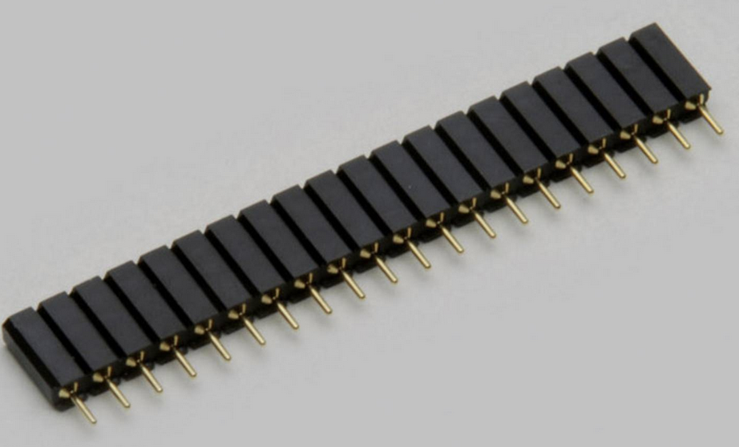 

*Break-away header strip*

## software & dependencies

* Arduino IDE: [www.arduino.cc](www.arduino.cc)
	* Install the board with the board manager: 
		* *esp32* by espressif
		* select board > ESP Arduino > ESP 32 Dev Module  
	* Install the following libraries: 
		* *movingAVG.h* by Jack Christensen
		* the other libs included in the code don't seem to need an install (perhaps come with ESP32 board definitions? > check)
* Eagle (if you want to edit or redesign the board)
* GIMP or photoshop (if you want to edit the milling files directly)


## manufacturing the shield

### prototyping setup

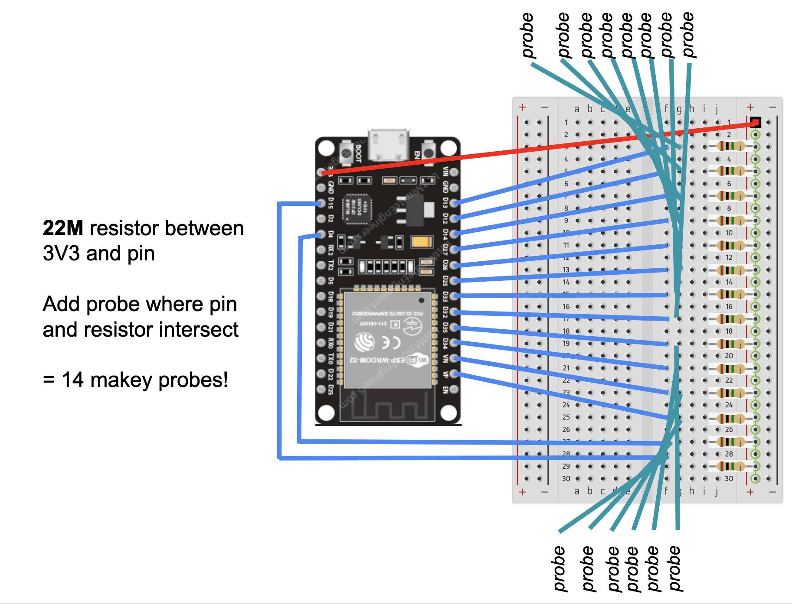 

### schematic v.1

 

### board v.1 

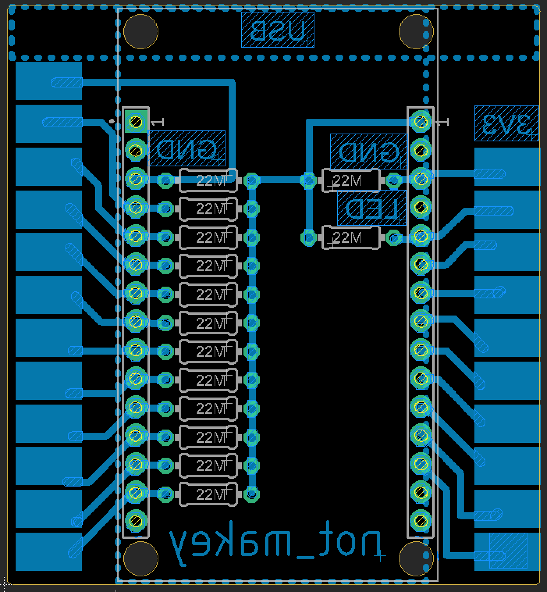 

### fabrication files for Roland modela MDX-20

####**Exporting the design from Eagle**

* exported as PNG images from Eagle at 1000 dpi in monochrome
	* MILLING - traces - exported layers: bottom, pads, via's
	* DRILLING - holes and board outline - exported layers: vias & 

####**Editing the images**

* resize images to 50% in photoshop (something happens in the export from eagle)

#####*Bottom_v1.png*

* deleted little bits and text with bucket tool
* added new text (that is not in mirror image :D) 

 


#####*Holes_v1.png* 

* Deleted the big 4 holes on top and bottom of the board, they're not needed but came with the footprint

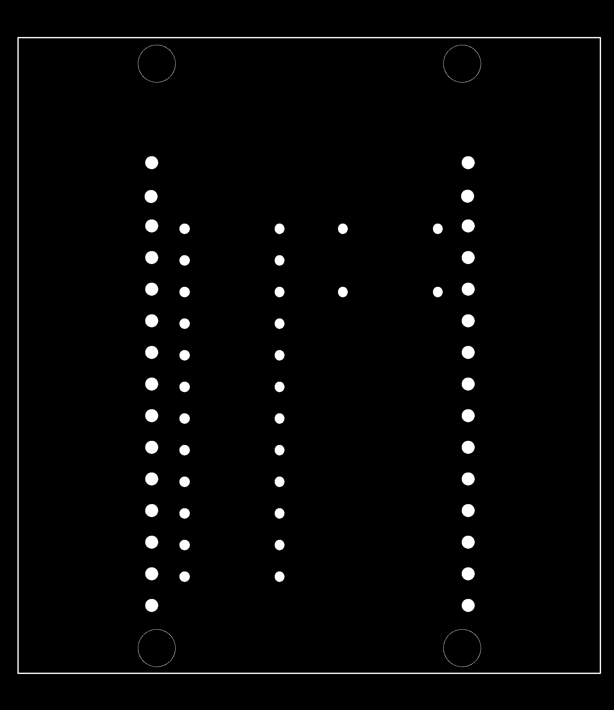 


#####*Dimension_v1.png*

* manually drew a rectangle larger than the board outline to make sure the board dimension is visible in the image (otherwise it's right at the edge)

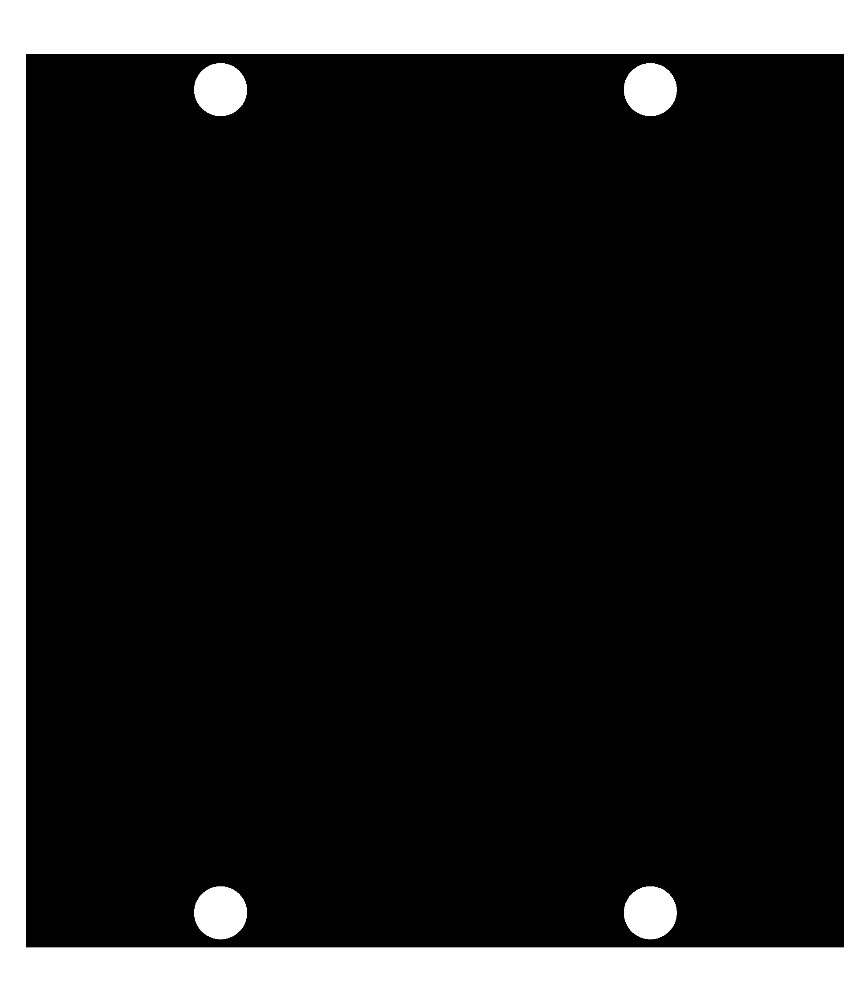 
	

### milling the PCB

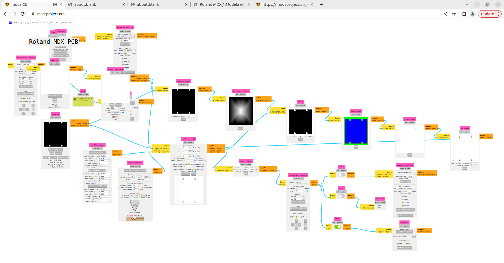 


* Mill the [bottom.png file](./fabrication/bottom.png)
* Drill holes [cut.png file](./fabrication/cut.png)
* Mill outline [outline.png file](./fabrication/?????)
* Wash
* Test connections
* Make corrections

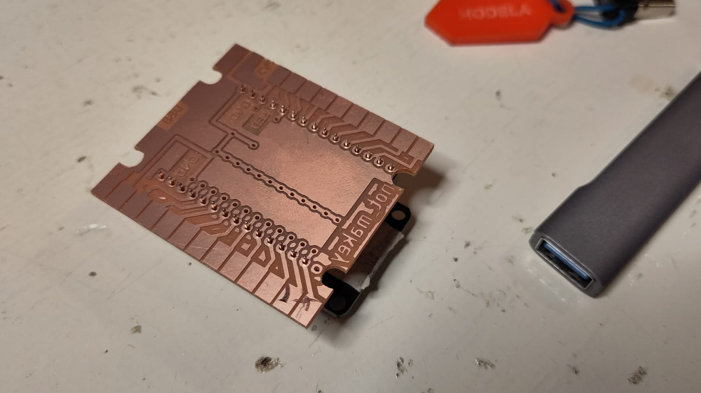

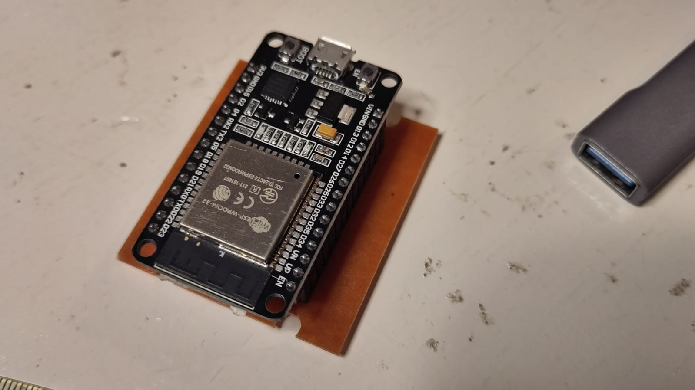 

### soldering

Solder resistors & connectors as per board layout

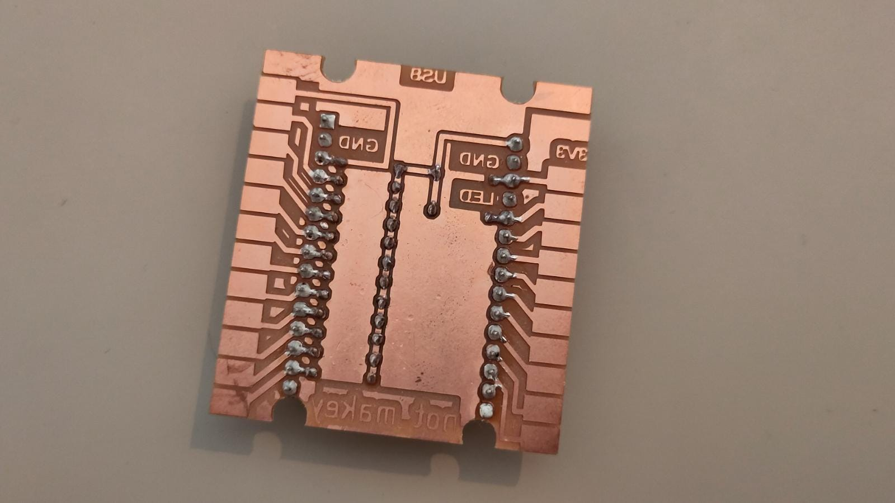

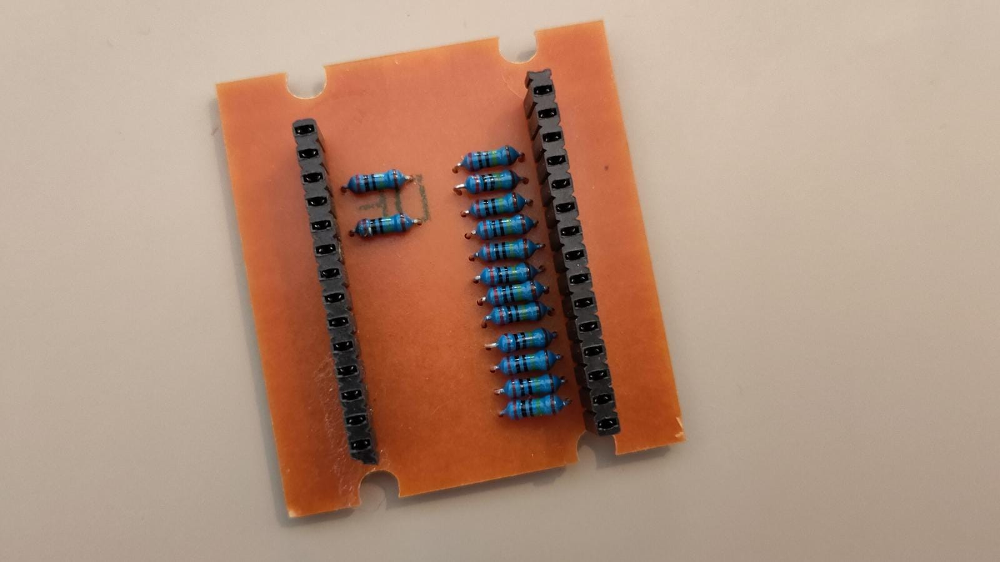

## wishes based on v.1

* pads are very small, not handy. Add second row of connector pins instead? (saves space)
* bigger footprint for resistors (min .8mm drill holes, thicked pads)
