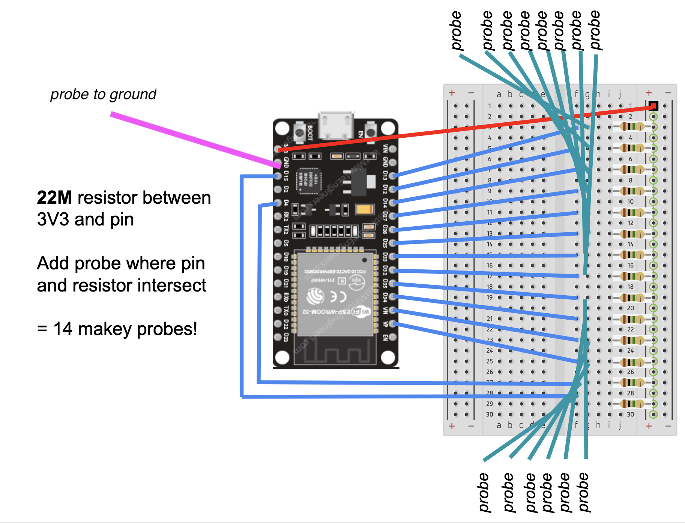

# not_makey

This repository describes how to manufacture a shield for the ESP32, and the code to program pins as resistive touch sensors that each send strings to a laptop over Bluetooth. It is programmed to send letters that correspond with PJ machine keycodes used in e.g. this workshop https://github.com/hackersanddesigners/interfacial-workout-23

## tools

* Roland Modela MDX-20 with MODS for pcb production installed (only works in Chrome) modsproject.org

Note that this process doesn't require Gerber files, instead you need a 1000 DPI black and monochrome images of the bottom of the board, and separate files with holes and the board outline).

* Soldering station, solder, clippers

## bill of materials

* an ESP32 WROOM devkit, e.g. [this one from Espressif](https://www.espressif.com/en/products/modules/esp32) €14,49 at [Reichelt](https://www.reichelt.nl/nl/nl/entwicklungsboard-esp32-wroom-32e-esp32devkitc32e-p341303.html?&trstct=pos_1&nbc=1)
* mini usb programming cable e.g. [this one at kiwi](https://www.kiwi-electronics.com/nl/microusb-kabel-usb-a-naar-micro-b-15cm-3240?search=usb-A%20naar%20micro-b) €1,25
* single row break-away female header strips (you need 2x a single row strips of 15 positions) e.g. [this one](https://www.reichelt.nl/nl/nl/vrouwelijke-connector-2-54mm-1x20-scheidbaar-vertind-fis-bl1-20-z-p283794.html?&nbc=1) at Reichelt €1,22 each
* 14x 22Mohm resistors e.g. [this one](https://nl.farnell.com/yageo/hhv-25jt-52-22m/res-22m-5-250mw-axial-metal-film/dp/1779371?st=22m%20ohm%20resistor) at Farnell €0,07 each. These can be hard to find in DIY shops you might need to look at Farnell, Mouser, or get some from China :(
* 14 or more Alligator clips to connect your DIY buttons to the board

 

*Break-away header strip*

## software & dependencies

* Arduino IDE: [www.arduino.cc](www.arduino.cc)
	* Install the board with the board manager: 
		* *esp32* by espressif
		* select board > ESP Arduino > ESP 32 Dev Module  
	* Install the following libraries: 
		* *movingAVG.h* by Jack Christensen
		* the other libs included in the code don't seem to need an install (perhaps come with ESP32 board definitions? > check)
* Eagle (if you want to edit or redesign the board)
* GIMP or photoshop (if you want to edit the milling files directly)

## acknowledgments

* Joylab's Jay Silver & Erik Rosenbaum's *MakeyMakey board* [https://github.com/sparkfun/MaKeyMaKey](https://github.com/sparkfun/MaKeyMaKey)
* Manualbl's [repository on using ESP32 as Bluetooth Keyboard](https://gist.github.com/manuelbl/66f059effc8a7be148adb1f104666467)
* Jack Christensen's [moving average library](https://github.com/JChristensen/movingAvg)

## Manufacturing the shield

## prototyping setup

 

## schematic v.1

 

## board v.1 

 

## fabrication files for Roland modela MDX-20

###**Exporting the design from Eagle**

* exported as PNG images from Eagle at 1000 dpi in monochrome
	* MILLING - traces - exported layers: bottom, pads, via's
	* DRILLING - holes and board outline - exported layers: vias & 

###**Editing the images**

* resize images to 50% in photoshop (something happens in the export from eagle)

####*Bottom_v1.png*

* deleted little bits and text with bucket tool
* added new text (that is not in mirror image :D) 

 

####*Holes_v1.png* 

* Deleted the big 4 holes on top and bottom of the board, they're not needed but came with the footprint

 

####*Dimension_v1.png*

* manually drew a rectangle larger than the board outline to make sure the board dimension is visible in the image (otherwise it's right at the edge)

 

### Wishes board design v.2

* no pads but connector pins? (saves space)
* bigger footprint for resistors (min .8mm drill holes, thicked pads)
* more freehand design
	* brush size: min 24 pt (black lines on white board)
	* prepare photoshop file with layers of footprint 
	

## Milling the PCB

 

* Mill the [bottom.png file](./fabrication/bottom.png)
* Drill holes [cut.png file](./fabrication/cut.png)
* Mill outline [outline.png file](./fabrication/?????)
* Wash
* Test connections
* Make corrections

 

### Soldering

* resistors
* connectors

## Programming the ESP

What the program does.... bla bla bla

### Select the board & port

### Compile the code to check libs are working

### Upload to the board

### Connect to device via Bluetooth

### Check the serial monitor

### Open a notepad to test

## Bringing it all together

Connect the ESP to the shield, taking care the orientation is correct. 

Test by touching a resistor pad with one finger, while touching the 3V3 with the other finger. The principle is the same as makey makey, but here the resistors are connected as a pull-up resistor (keeps the signal high until a change is registered), so you touch 3V3 instead of GND.

	
